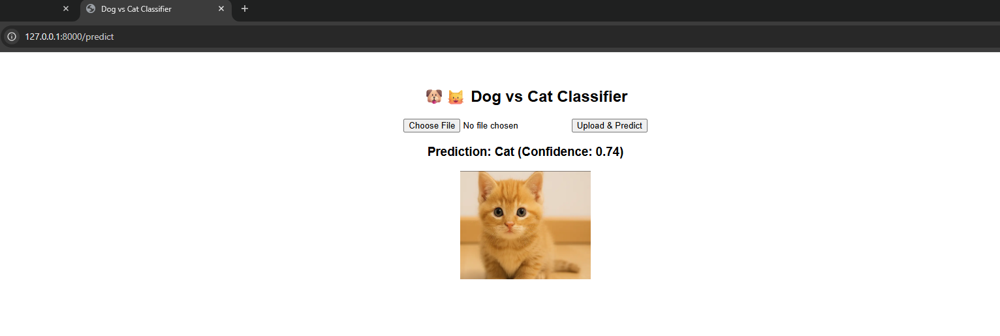

🐶🐱 Dog vs Cat Image Classifier (FastAPI + TensorFlow)

📌 Project Overview

This project is a web-based Dog vs Cat image classifier built using FastAPI and a pre-trained Keras/TensorFlow model.
The application allows users to upload an image (Dog or Cat) through a simple HTML page, and the model predicts whether the uploaded image is a Dog or a Cat with a confidence score.

🛠️ Tech Stack Used

Python

TensorFlow / Keras → for loading and running the trained CNN model (my_model.keras).

FastAPI → to serve the ML model as a web app.

Jinja2 → for rendering the HTML template.

Pillow (PIL) → for image preprocessing.

Uvicorn → ASGI server to run the FastAPI app.

⚙️ Installation & Setup
1. Create virtual environment (recommended)
python -m venv venv
Activate:
.\venv\Scripts\activate      # Windows

2. Install dependencies
pip install -r requirements.txt

Or install manually:
pip install fastapi uvicorn tensorflow pillow python-multipart jinja2

🚀 Running the App
Start the FastAPI server:
uvicorn main:app --reload

Then open your browser:
👉 http://127.0.0.1:8000

🖼️ Usage

Go to the web page.
Upload an image (.jpg, .png, etc.).
Click Upload & Predict.
The app will display:
Predicted class (Dog or Cat)
Confidence score
Uploaded image preview

✅ Example Output
Prediction: Dog (Confidence: 0.87)

📖 Notes

The model was trained separately in Google Colab and saved as my_model.keras.
Ensure that the target_size in main.py matches the training image size (e.g., 128x128).
Uploaded images are stored in static/uploads/.